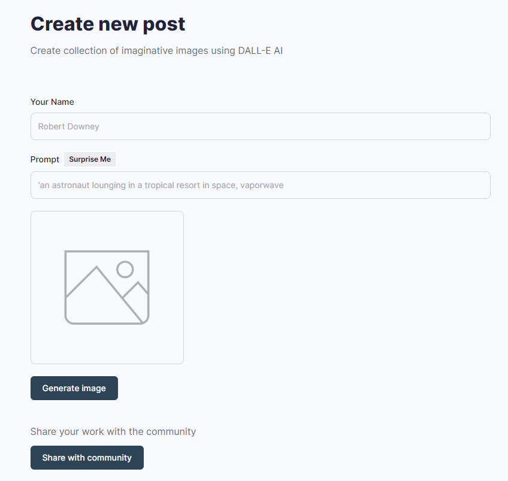
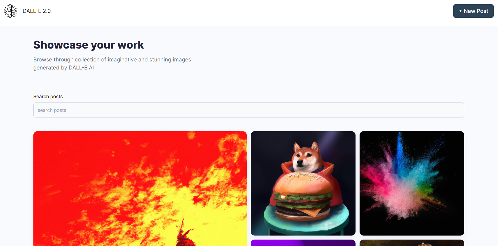

# DALL-E_Clone

This web app is a clone to one of the popular text-based image generation tool DALL-E by OpenAI made using MERN stack, OpenAI and Cloudinary APIs.

# Getting started:

After cloning the repository: 
* Create a new terminal
* ```cd .\client\```
* ```npm install```
* ```npm run dev```
  
This starts the frontend of web application

* Create new API Keys in <a href="https://platform.openai.com/account/api-keys">OpenAI</a> and <a href="https://console.cloudinary.com/console/c-62ee3051d05817486e68ae1594bc9d">Cloudinary</a>
* Create a new project and add new database to it in <a href="https://cloud.mongodb.com/v2#/org/64a12500e3797d3fc13ebdd6/projects">MongoDB Atlas</a>
* Create a new terminal
* Create a new .env file in server folder as follows:


*  ```cd .\client\```
*  ```npm install```
*  ```npm start```

The application is now connected to backend too.

# Overview:


